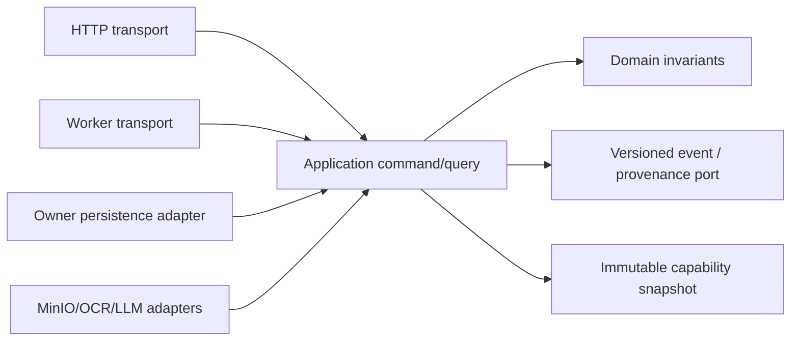
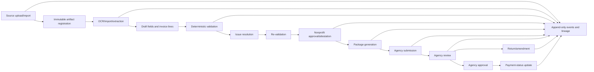

# Data Flow

This document describes the required end-to-end data flow for ContractView. Each flow must preserve provenance, deterministic validation, versioned configuration, and human authority.

The flow executes through the [modular-monolith](modular-monolith.md) layer
contract. HTTP and worker entry points invoke application commands; application
handlers use owner repository/capability ports; persistence and integration
adapters point inward. No flow step authorizes direct cross-capability SQL.

## Layered Command Flow

The composition root wires adapters to ports. Arrows from adapters point to
the contracts they implement; domain/application code never imports outward.

## End-to-End Flow

## Flow Stages

### 1. Source Upload or Import

Inputs include PDFs, images, CSV/XLSX ledgers, payroll exports, receipts, vendor invoices, proof of payment, timesheets, and bank records.

Required records:

- Uploader, organization, tenant, contract context, timestamp.
- Artifact hash or immutable object reference.
- Malware scan result.
- Deduplication result.
- Source type and initial classification.

### 2. Artifact Registration

Registered artifacts are immutable. If a file is replaced, amended, redacted, or regenerated, the system creates a new artifact version or related artifact.

Required records:

- Artifact id and version.
- Object reference or storage location.
- Hash/checksum.
- Source metadata.
- Relations to invoice, contract, upload batch, and importer job.

### 3. OCR, Import, and Extraction

The extraction pipeline converts source artifacts into draft structured data.

Required records:

- Parser/importer/model/prompt version.
- Source location: page, row, cell, bounding box, or section.
- Confidence for probabilistic extraction.
- Mapping and schema versions.
- Draft field values.

Human corrections must create lineage events instead of overwriting history.

### 4. Draft Invoice Assembly

The workflow service assembles canonical invoice entities and line items from imported and extracted data.

Required records:

- Invoice version.
- Line-item to source-field relations.
- Budget category mapping version.
- Exclusions, annotations, and correction events.
- Draft totals and remaining budget calculations.

Configuration is read as an immutable bundle snapshot. Draft assembly creates
runtime invoice records that reference the exact configuration version; it
does not copy mutable configuration into runtime state.

### 5. Deterministic Validation

The validation engine evaluates invoice and package-level fields against contract budgets and agency rules.

Required records:

- Validation run id.
- Invoice version.
- Artifact versions.
- Budget version.
- Schema, mapping, rule, workflow, template, and parser/model versions.
- Rule inputs, outputs, severity, reason code, and remediation guidance.

Before rule execution, the application captures an immutable invoice snapshot
and persists a content-addressed validation input manifest. The engine validates
and executes shared rule contracts. Reproduction loads that exact manifest and
snapshot; it does not consult the current draft or current active
configuration.

Submission-blocking results must be explainable without trusting an opaque model response.

### 6. Issue Resolution

Users resolve validation flags before submission.

Required records:

- Issue id, status, severity, category, required actor, and affected line.
- Comments and structured responses.
- Replacement artifact references.
- Waiver or accepted-risk actor, permission, rationale, and timestamp.
- Re-validation runs after changes.

### 7. Nonprofit Approval and Submission

An authorized nonprofit actor reviews the final invoice, validation status, unresolved warnings, and generated package preview before attestation.

Required records:

- Human attestation event.
- Submitted invoice version.
- Generated package artifact and manifest.
- Validation summary.
- Submission receipt and channel.

Submitted packages are locked. Later changes require amendment, return, or resubmission.

Package generation persists a versioned build input and a reproduction manifest
containing the exact template/renderer contract, canonical claim-column order,
validation input, generated-file digests, and final archive hash. Reproduction
must verify every retained dependency and produce identical bytes.

### 8. Agency Review, Return, and Approval

Agency reviewers inspect the package, evidence, validation trace, comments, and issue history.

Required records:

- Review decision event.
- Actor, role, reason, timestamp, and affected invoice version.
- Return reason codes and requested corrections.
- Approval event and any escalation or supervisor decision.

Platform-screened status must remain distinct from agency-approved status.

### 9. Payment Status and Archive

Payment status can be tracked after approval.

Required records:

- Status source.
- Actor or integration job.
- Timestamp and invoice version.
- Payment reference where available.
- Archive event when retention rules permit.

### 10. Audit Reconstruction

Auditors must be able to reconstruct how a claim was produced and reviewed.

Required evidence:

- Source artifact and generated package hashes.
- Field lineage.
- Validation runs.
- Configuration bundle versions.
- Workflow transition events.
- Human authority events.
- Return/amendment/resubmission chain.
- Validation input and package reproduction manifests, including independently
  recomputed hashes and generated-file integrity results.

Audit reconstruction may use a declared read model spanning capability owners.
It is read-only and cannot become canonical workflow state or an escape hatch
for cross-capability command SQL.

## Failure Modes To Preserve

- Failed upload or scan must not create usable claim lines.
- Failed extraction must leave source artifacts inspectable and route to manual review.
- Failed validation job must not mark an invoice ready for approval.
- Failed package generation must not create a submission.
- Failed integration submission must not corrupt invoice state.
- Retention or deletion workflows must preserve required audit evidence through legal hold, tombstone, hash retention, or redacted lineage records.
